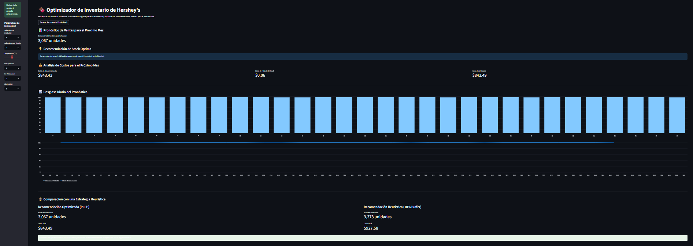

# Proyecto_de_Optimización_de_Inventario_de_Hershey's 🍫
Este proyecto de Data Science presenta una solución integral y de principio a fin para la optimización de la gestión de inventario en una empresa distribuidora como Hershey's. Demuestra un pipeline de datos completo, desde la ingesta de datos brutos y el análisis exploratorio hasta el modelado predictivo y la optimización basada en métricas de negocio.    

El objetivo principal es responder a la pregunta crítica: "¿Cuál es el nivel de stock óptimo para cada producto y tienda que minimice los costos totales (costos de almacenamiento y costos de faltante)?" La solución combina un modelo de machine learning para predecir la demanda con un modelo de programación lineal para encontrar el nivel de inventario más rentable. 

## Estructura del Proyecto 📁
El proyecto está organizado en archivos modulares para garantizar claridad y escalabilidad. 
- main.py: El script orquestador que ejecuta todo el pipeline de datos.
- app.py:  La aplicación web en Streamlit que funciona como el dashboard interactivo para las recomendaciones de stock.
- config.py: Un archivo de configuración centralizado para todos los parámetros de negocio, rutas de archivos y constantes del modelo.
- data_utils.py: Un módulo para la ingesta de datos, la limpieza y el análisis exploratorio de datos (EDA).
- model_utils.py: Un módulo para el entrenamiento del modelo, la predicción y la lógica central de optimización de inventario usando PuLP.
- mlruns/:  Un directorio creado por MLflow para rastrear los experimentos del modelo y guardar el modelo entrenado.

## Tecnologías Utilizadas 🐍
- Pandas: Para la manipulación, limpieza y análisis de datos.
- NumPy: Para operaciones numéricas eficientes.
- Scikit-learn: Para construir el pipeline de machine learning y el modelo Gradient Boosting Regressor.
- MLflow: Para gestionar el ciclo de vida del machine learning, rastrear experimentos y registrar el modelo de producción.
- PuLP: Una librería de programación lineal utilizada para resolver el problema de optimización de inventario.
- Streamlit: Para construir un dashboard web interactivo y fácil de usar.
- Matplotlib & Seaborn: Para la visualización de datos durante el EDA.
- SQLite3: Para gestionar los datos de clima en una base de datos simple.

## Instalación y Configuración ⚙️
- Clonar el Repositorio (Bash):  
git clone https://github.com/ADAA-404/Proyecto-de-optimizacion-de-inventario-de-Hershey.git   
cd Proyecto-de-optimizacion-de-inventario-de-Hershey

- Crear un Entorno Virtual (es altamente recomendable usar un entorno virtual para gestionar las dependencias.):    
python -m venv venv  
source venv/bin/activate  # En macOS/Linux  
venv\Scripts\activate      # En Windows  

- Instalar Dependencias:  
pip install pandas numpy scikit-learn matplotlib MLflow PuLP Streamlit Seaborn SQLite3

- Descarga los datos:
Para este script utilizamos bases de datos en diferentes formatos que puedes encontrar en el repositorio o en caso contrario proporciona tus propios datos si es que tienes documentos de este estilo.

- Configurar la ruta de los datos (si la necesitas):  
DATA_FOLDER_PATH = r"ruta/a/la/carpeta/data"

En esta ocasion el codigo se escribio en Jupyter Notebook para Python.

## Modo de Uso 📎
Este proyecto requiere que haya cuatro archivos de datos en el directorio raíz: sales_data.csv, marketing_campaigns.json, products_info.json y weather_data.db.  
Estos archivos no están incluidos en este repositorio. Asegúrate de tener estos archivos en el mismo directorio que los scripts del proyecto.   

- Ejecutar el Pipeline Principal: Ejecuta el script principal para realizar el ETL de datos, el EDA, el entrenamiento del modelo y guardar el modelo usando MLflow. Este paso también imprimirá insights clave y los resultados finales de la optimización en la consola.   
- Lanzar el Dashboard Interactivo: Una vez que el modelo haya sido entrenado y guardado, inicia la aplicación de Streamlit para interactuar con el modelo y generar recomendaciones en tiempo real.  

## Contribuciones 🖨️
Si te interesa contribuir a este proyecto o usarlo independiente, considera:  
- Hacer un "fork" del repositorio.
- Crear una nueva rama (git checkout -b feature/nueva-caracteristica).
- Realizar tus cambios y "commitearlos" (git commit -am 'Agregar nueva característica').
- Subir tus cambios a la rama (git push origin feature/nueva-caracteristica).
- Abrir un "Pull Request".

## Licencia 📜
Este proyecto está bajo la Licencia MIT. Consulta el archivo LICENSE (si aplica) para más detalles.

[English Version](README.en.md)
